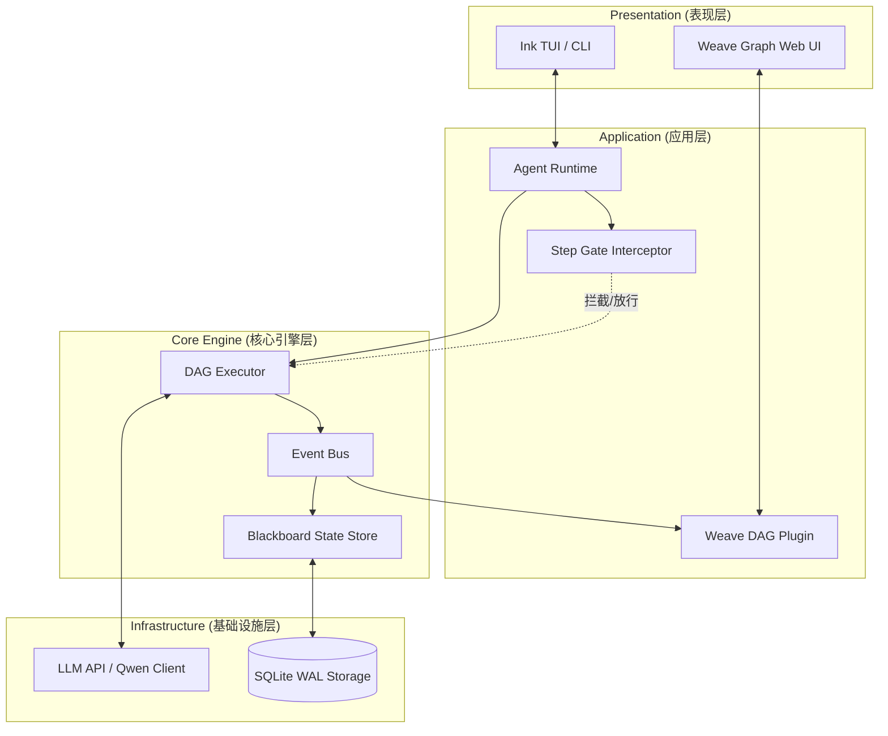

<!-- 💡 Maintainers: 记得在 GitHub 仓库右侧栏配置 Topics: #typescript #agent-framework #llm #dag #tui #time-travel #ai-agents -->

<div align="center">
  <h1>🌌 Dagent</h1>
  <p><strong>可观测、可控制、可扩展的下一代 TypeScript 终端智能体引擎</strong></p>

  <p>
    <a href="README_EN.md">English</a> | <b>简体中文</b>
  </p>

  [](https://www.npmjs.com/package/dagent)
  [](https://github.com/your-org/dagent/actions)
  [](https://codecov.io/gh/your-org/dagent)
  [](https://www.typescriptlang.org/)
  [](https://nodejs.org/)
  [](https://makeapullrequest.com)
  [](#)

  <br/>
  <!-- 占位符：高清 GIF 演示，展示敲击命令、UI 渲染、Step Gate 拦截到生成图谱的丝滑全过程 -->
  
</div>

<br/>

Dagent 是一个为复杂任务设计的 **“白盒化”终端智能体 (CLI Agent) 工程**。它拒绝黑盒执行，致力于让 Agent 的每一步思考和操作都清晰可见、受人控制。

## 📖 目录 (Table of Contents)
- [🤔 为什么选择 Dagent？ (Why Dagent)](#-为什么选择-dagent-why-dagent)
- [✨ 核心特性 (Features)](#-核心特性-weave-架构的极致展现)
- [🚀 核心使用场景 (Use Cases)](#-核心使用场景-use-cases)
- [🛠️ 快速上手 (Quick Start)](#️-快速上手-quick-start)
- [🕹️ 核心交互指南 (Commands)](#-核心交互指南)
- [🏗️ 架构概览 (Architecture)](#️-架构概览)
- [🤝 参与贡献 (Contributing)](#-参与贡献)

---

## 🤔 为什么选择 Dagent？ (Why Dagent)

传统 Agent 框架往往是不可控的“黑盒”——执行过程难以追踪，一旦遇到危险操作无法人工干预，报错后只能浪费大量 Token 重头再来。Dagent 彻底颠覆了这一现状：

| 痛点场景 | 传统 Agent 框架 (黑盒) ⬛ | Dagent (The Weave Way) 🌌 |
| :--- | :--- | :--- |
| **执行透明度** | `console.log` 满天飞，很难理清复杂逻辑链路 | **白盒 DAG 可视化**，思考与工具调用轨迹实时渲染 |
| **高危操作控制** | 自动执行 `rm -rf` 或错误 API，造成不可逆破坏 | **Step Gate 审批闸门**，关键工具调用前精准拦截 |
| **错误调试与恢复** | 报错后上下文丢失，只能修改代码后**重头跑一遍** | **WAL 持久化与状态分叉**，支持从任意错误节点重放或回溯 |

---

## ✨ 核心特性：WEAVE 架构的极致展现

Dagent 的灵魂在于 **WEAVE** 架构，它赋予了系统前所未有的透明度与掌控力：

*   **👁️ Weave 实时可视化 (DAG Visibility)**
    *   突破终端文本限制，实时渲染 Agent 思考与执行的有向无环图 (DAG)。
    *   内置沉浸式 Web 视图子系统 (`weave-graph-web`)，提供上帝视角的节点流转监控。
*   **🚦 Step Gate (人机协作审批闸门)**
    *   关键高危操作，必须人类授权。
    *   工具执行前精准拦截，支持 **放行 (Approve) / 动态修改参数 (Edit) / 跳过 (Skip) / 紧急终止 (Abort)**。
*   **⏪ Time-Travel & Forking (时间旅行与状态分叉)**
    *   基于 WAL (Write-Ahead Logging) 和黑板模式 (Blackboard) 架构。
    *   支持确定性重放 (Deterministic Replay)，一键回溯历史节点，并在任意状态分叉出新的执行路径。
*   **💬 多轮持久会话**
    *   常驻内存的对话上下文，提供丝滑的连续交互体验。

---

## 🚀 核心使用场景 (Use Cases)

*   **🕵️ 自动化代码审查员**：深入本地仓库，抓取 Git Diff，结合架构规范生成 Review 报告。
*   **🛡️ 安全的自动化运维 (DevOps)**：编写部署脚本，在执行高危 shell 命令前自动触发 Step Gate 拦截。
*   **🧪 Agent 行为调试沙盒**：利用 Time-Travel 能力，完美复现 Agent 陷入死循环或逻辑崩盘的 Bug 现场。

---

## 🛠️ 快速上手 (Quick Start)

顶级体验，从无脑复制粘贴开始。

### 1. 环境准备
确保已安装 Node.js (>=18) 和 `pnpm`。

```bash
# 克隆仓库并安装依赖
git clone https://github.com/your-org/dagent.git
cd dagent
pnpm install
```

### 2. 模型配置
配置环境变量：

```bash
cp config/llm.config.template.json config/llm.config.json
cp .env.example .env
```

**示例 `.env` 文件内容：**
```env
# 必填：你的大模型 API Key（默认使用 Qwen，也兼容 OpenAI 格式）
OPENAI_API_KEY=sk-your-api-key-here

# 可选：如果使用自定义网关代理
# OPENAI_BASE_URL=https://api.openai.com/v1
```

### 3. 启动引擎并体验 "Aha Moment"
```bash
# 开发模式直接起飞
pnpm dev
```

启动后，**请在终端直接输入以下指令，体验 Dagent 的威力：**

```text
? [User]: /weave step 帮我读取 logs 目录下的错误日志，分析原因，并生成一个修复脚本。
```
*(你将看到 Agent 自动绘制出思考 DAG，并在执行文件读取或写入前触发 Step Gate 拦截，等待你的审批！)*

---

## 🕹️ 核心交互指南

在 Dagent 交互式提示符下，你可以使用以下命令控制引擎：

| 命令 | 说明 |
| :--- | :--- |
| `直接输入` | 发起多轮对话问答 |
| `/weave on` | 开启终端内的 DAG 可视化渲染 |
| `/weave off` | 关闭可视化，回归极简对话模式 |
| `/weave step` | **开启 Step Gate 审批模式** (推荐用于调试和高危任务) |
| `/q` 或 `/exit` | 安全退出并保存会话状态 |

*(💡 Tip: 你也可以行内触发，例如：`/weave 请分析系统架构`)*

---

## 🏗️ 架构概览

Dagent 采用严谨的分层与插件化架构设计。以下是核心数据与指令流转图解（完美适配暗黑模式）：



详细技术演进请参考：[架构与文件说明](docs/project/architecture-and-files.md)

---

## 🤝 参与贡献

Dagent 是一个追求卓越工程质量的开源项目，我们热烈欢迎所有形式的贡献！

- 📖 请首先阅读我们的 [贡献指南 (CONTRIBUTING.md)](CONTRIBUTING.md) 和 [行为规范 (CODE_OF_CONDUCT.md)](CODE_OF_CONDUCT.md)。
- 💡 提交代码前，请务必阅读架构宪法 [`WEAVE_ARCH.md`](WEAVE_ARCH.md)。
- 📝 我们严格遵循 [约定式提交 (Conventional Commits)](https://www.conventionalcommits.org/) 规范。

**开发验证流：**
```bash
pnpm build
node scripts/verify-step-gate.mjs
```

## 💬 加入社区

- 🐦 **Twitter/X**: [@DagentTeam](#)
- 💬 **Discord**: [Join our Server](#)
- 🟢 **WeChat / 微信交流群**: 扫描[二维码占位符]获取最新动态

## 📄 License

本项目基于 [MIT License](LICENSE) 开源。