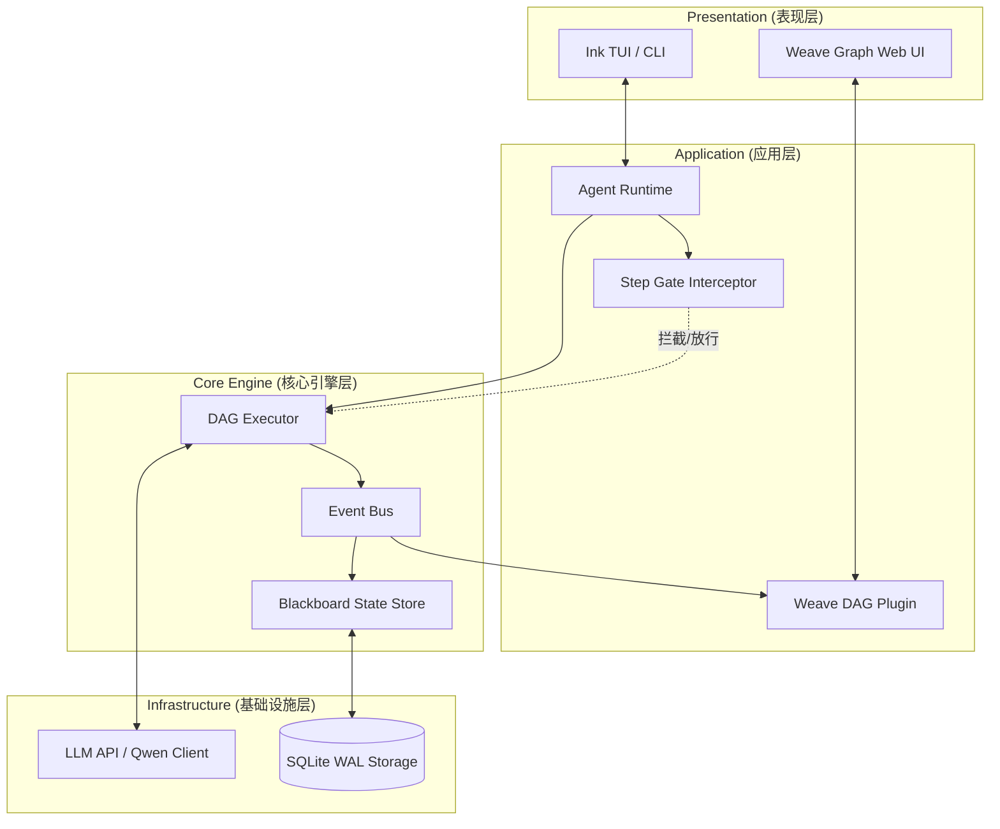

<!--  -->
<!-- 💡 Maintainers: 记得在 GitHub 仓库右侧栏配置 Topics: #typescript #agent-framework #llm #dag #tui #time-travel #ai-agents -->

<div align="center">
  <h1>🌌 Weave Engine</h1>
  <p><strong>可观测、可控制、可回溯的下一代 TypeScript 终端智能体引擎</strong></p>

  <p>
    <a href="README_EN.md">English</a> | <b>简体中文</b>
  </p>

  [](https://www.npmjs.com/package/dagent)
  [](https://github.com/your-org/dagent/actions)
  [](https://www.typescriptlang.org/)
  [](https://nodejs.org/)
  [](#)
</div>

<br/>

Weave 是一个面向复杂任务设计的**白盒化终端智能体 (CLI Agent) 引擎**。它通过引入有向无环图 (DAG) 拓扑、黑板模式 (Blackboard) 与预写式日志 (WAL)，打破了大语言模型执行时的“黑盒状态”，让 Agent 的每一次推演、工具调用与状态流转都清晰可见且受人控制。


  <br/>
</div>

---

## 📖 目录
- [🤔 为什么选择 Weave？](#-为什么选择-weave)
- [✨ 核心特性](#-核心特性)
- [🚀 典型使用场景](#-典型使用场景)
- [🛠️ 快速上手](#️-快速上手)
- [🕹️ 核心指令](#-核心指令)
- [🏗️ 架构拓扑](#️-架构拓扑)
- [🤝 参与贡献](#-参与贡献)

---

## 🤔 为什么选择 Weave？

当前主流的 Agent 框架在应对复杂任务时，往往受困于不可见的执行链路与脆弱的状态管理。Weave 从底层架构出发，提供了一种更具工程确定性的解法：

| 维度 | 传统 Agent 框架 | Weave 引擎架构 |
| :--- | :--- | :--- |
| **状态追踪** | 依赖控制台日志打印，难以理清复杂推理链路 | **DAG 拓扑树**：将推理与执行映射为严格的有向无环图，提供全链路的可观测性。 |
| **运行时干预** | 工具调用容易失控，无法在执行中途安全阻断 | **Step Gate 物理拦截**：基于生命周期钩子的挂起机制，实现高危操作前的强制人工审批。 |
| **容灾与复用** | 内存状态极易丢失，异常后需重新消耗全量 Token | **Git 式时空分叉**：基于 WAL 日志按需恢复图状态，支持从任意断点低成本 Fork 新分支。 |

---

## ✨ 核心特性

Weave 的能力不仅停留在终端交互层，更深入到了防御性的底层基建：

* **👁️ 动态拓扑可视化 (Dynamic DAG Visibility)**
  引擎调度器 (DAG Executor) 可以在终端 TUI 或独立的 Web 视图中，实时投射 Agent 的执行链路，精确观测每一个 Node 的 `Pending`、`Running` 或 `Success` 状态。
* **🚦 人机协作审批闸门 (Step Gate Interceptor)**
  面向生产环境的安全设计。当 Agent 企图执行高危操作（如 Shell 命令、文件覆写）时，引擎将挂起当前执行流。开发者可在终端执行放行 (Approve)、修改参数 (Edit)、跳过 (Skip) 或终止 (Abort)。
* **⏪ 基于 WAL 的时空穿梭 (Time-Travel Debugging)**
  内置微批处理机制，将节点状态增量安全刷入 SQLite。配合**黑板模式 (Blackboard)** 剥离庞大的 LLM 文本载荷，Weave 实现了低成本的事件重放。随时回溯至历史错误节点，修正 Prompt 并派生全新的执行时间线。
* **💬 多轮持久会话**
  常驻内存的对话级上下文管理，提供低延迟的连续交互体验。

---
## 🏗️ 架构概览

Weave 采用严谨的分层与插件化架构设计。以下是核心数据与指令流转图解：



详细技术演进请参考：[架构与文件说明](docs/project/architecture-and-files.md)

---

## 🚀 典型使用场景

* **安全的自动化运维 (DevOps)：** 运行自动化部署与排障脚本，利用 Step Gate 在执行敏感 Shell 命令前强制引入人工校验。
* **Agent 逻辑调试沙盒：** 利用 Time-Travel 能力，无损复现大模型陷入死循环或产生幻觉的异常现场，极大提升 Prompt 工程的调试效率。

---

## 🛠️ 快速上手

### 1. 环境准备
Weave 引擎依赖 Node.js 原生特性，请确保运行环境为 Node.js (>=18) 并已安装 `pnpm`。

```bash
git clone [https://github.com/your-org/dagent.git](https://github.com/your-org/dagent.git)
cd dagent
pnpm install
```

### 2. 模型配置
配置环境变量：

```bash
cp config/llm.config.template.json config/llm.config.json
cp .env.example .env
```

**示例 `.env` 文件内容：**
```env
# 必填：你的大模型 API Key（默认使用 Qwen，也兼容 OpenAI 格式）
OPENAI_API_KEY=sk-your-api-key-here

# 可选：如果使用自定义网关代理
# OPENAI_BASE_URL=https://api.openai.com/v1
```

### 3. 启动引擎并体验 "Aha Moment"
```bash
# 开发模式直接起飞
pnpm dev
```

启动后，**请在终端直接输入以下指令，体验 Dagent 的威力：**

```text
? [User]: /weave step 帮我读取 logs 目录下的错误日志，分析原因，并生成一个修复脚本。
```
*(你将看到 Agent 自动绘制出思考 DAG，并在执行文件读取或写入前触发 Step Gate 拦截，等待你的审批！)*

---

## 🕹️ 核心交互指南

在 Weave 交互式提示符下，你可以使用以下命令控制引擎：

| 命令 | 说明 |
| :--- | :--- |
| `直接输入` | 发起多轮对话问答 |
| `/weave on` | 开启终端内的 DAG 可视化渲染 |
| `/weave off` | 关闭可视化，回归极简对话模式 |
| `/weave step` | **开启 Step Gate 审批模式** (推荐用于调试和高危任务) |
| `/q` 或 `/exit` | 安全退出并保存会话状态 |

*(💡 Tip: 你也可以行内触发，例如：`/weave 请分析系统架构`)*

---

## 🤝 参与贡献

Weave 是一个追求卓越工程质量的开源项目，我们热烈欢迎所有形式的贡献！

- 📖 请首先阅读我们的 [贡献指南 (CONTRIBUTING.md)](CONTRIBUTING.md) 和 [行为规范 (CODE_OF_CONDUCT.md)](CODE_OF_CONDUCT.md)。
- 💡 提交代码前，请务必阅读架构宪法 [`WEAVE_ARCH.md`](WEAVE_ARCH.md)。
- 📝 我们严格遵循 [约定式提交 (Conventional Commits)](https://www.conventionalcommits.org/) 规范。

**开发验证流：**
```bash
pnpm build
node scripts/verify-step-gate.mjs
```

## 📄 License

本项目基于 [MIT License](LICENSE) 开源。
